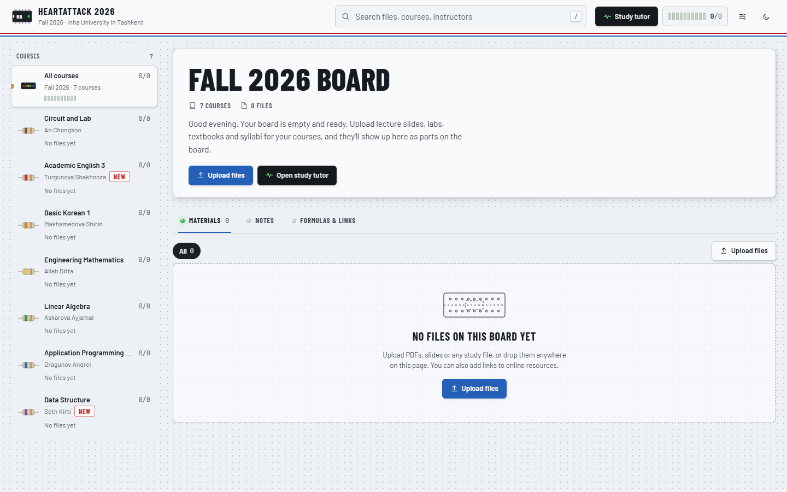
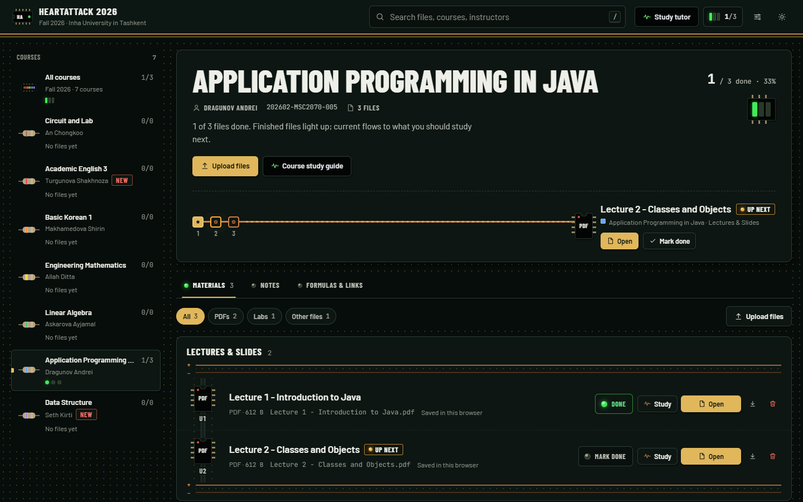

# HeartAttack 2026

A study desk for our Fall 2026 courses at Inha University in Tashkent. All your course files sit on one board. HeartAttack shows what to study next, tracks what you've finished, keeps notes and formula sheets, and includes a **free AI study tutor**.




## What it does

- **Course board.** Your 7 Fall 2026 courses start empty. Upload each course's files and they appear as parts on a breadboard. Mark a file done and its LED lights up; the amber pad shows what to study next.
- **Your own files.** Upload PDFs, slides, Word files, images or anything else, or add links. Drop files anywhere on the page to upload them.
- **Study tutor (AI).** Turns any uploaded file into a study guide with a concept diagram, the key formulas (LaTeX), a four-phase learning path and a self-test. You can ask follow-up questions, and saved guides reopen for free.
- **Notes, formulas and links.** Each course gets a notebook (Markdown, math, code), a formula sheet and a list of useful links, all written by you.
- **Day and night themes.** Works on phones too.

The whole app is one file, `index.html`. A tiny optional server (`relay/server.js`) hosts it online and makes Ollama API keys work.

## Getting started

Open HeartAttack from its website (see [Put it online](#put-it-online-render-free)), or download this repo and double-click **`run_heartattack.bat`** (or open `index.html` in Chrome or Edge).

### Where your files are kept

Open **Settings → Study folder → Choose folder** and pick a place on your computer, for example **Documents**. HeartAttack creates a tidy folder there:

```
HeartAttack 2026├── README - how this folder works.txt
├── Application Programming in Java│   ├── Lectures & Slides│   ├── Labs & Assignments│   ├── Textbooks & Handbooks│   └── Syllabi & Information├── Circuit and Lab└── … one folder per course
```

- Files you upload are saved into the right course and category folder.
- Files you copy into these folders yourself show up on the board automatically.
- Removing a file in HeartAttack also deletes it from the folder (you get a few seconds to undo).
- After restarting the browser, click **Allow access** once so HeartAttack can open the folder again.

Study folders work in **Chrome and Edge on a computer**. On phones and in other browsers, uploads are saved inside the browser instead.

## Free AI setup (pick at least one)

Open **Settings** (the sliders icon, top right) and paste your own key. Keys are stored **only in your browser**; they are never written into the file or sent anywhere except to the AI provider you chose.

| Provider | Cost | How to get access |
|---|---|---|
| **Google Gemini** | Free tier | Create a key at [aistudio.google.com/apikey](https://aistudio.google.com/apikey) (about a minute, no card needed). |
| **OpenRouter** | Free models | Create a key at [openrouter.ai/settings/keys](https://openrouter.ai/settings/keys). Keep the model on **Free Models Router**, or pick any model marked free. Free models have a daily request limit. |
| **Ollama** | Free tier | Create a key at [ollama.com/settings/keys](https://ollama.com/settings/keys) and paste it into **Ollama API key**. Nothing to install. Click **Find models** to choose a model (the default is `gpt-oss:20b`). Needs the HeartAttack website or relay; see [Put it online](#put-it-online-render-free). |
| DeepSeek | Paid (cheap) | Optional backup: [platform.deepseek.com](https://platform.deepseek.com/api_keys). |

If one provider hits its limit, the tutor automatically tries the next one you've set up.

**Why Ollama needs the relay:** Ollama's online service doesn't accept requests straight from web pages, so HeartAttack sends them through its own small relay. The relay forwards only chat and model-list requests and passes your key to Ollama. It never saves or logs keys or messages.

- Using HeartAttack **from its website:** nothing extra to set up.
- Opening `index.html` **from a folder:** in Settings → *Relay address and Ollama app*, paste the website address (for example `https://heartattack.onrender.com`).
- Already have the **Ollama app** installed? Leave the key empty and set the app address instead.

## Put it online (Render, free)

1. Sign in at [render.com](https://render.com) with GitHub.
2. Click **New → Blueprint**, pick this repo, and click **Apply**. The included `render.yaml` sets everything up. (To do it by hand instead: **New → Web Service**, build command `npm install`, start command `npm start`.)
3. You get an address like `https://heartattack.onrender.com`. Share it with classmates; every push to `main` redeploys it.

On Render's free plan, the site goes to sleep after about 15 minutes without visitors, so the first visit afterwards takes 30–60 seconds to load.

You can also run it on your own computer with Node.js 18+: `npm start`, then open http://localhost:10000.

## Good to know

- **Your data stays with you.** Progress, notes, formulas, links, saved guides and API keys live in your browser, on each device separately. Pushing updates to the website doesn't erase them. Every classmate has their own, and the website and a copy opened from a folder keep separate data.
- **Everything is private.** Uploaded files stay in your study folder or your browser; nothing is uploaded to the website's server.
- **Keyboard:** `/` searches, `Esc` closes dialogs, `E` starts writing in Notes, and `Enter` sends a question to the tutor.
